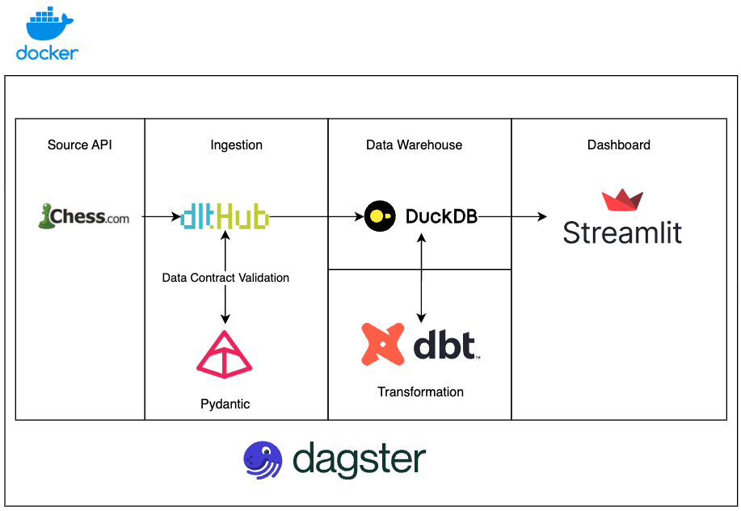
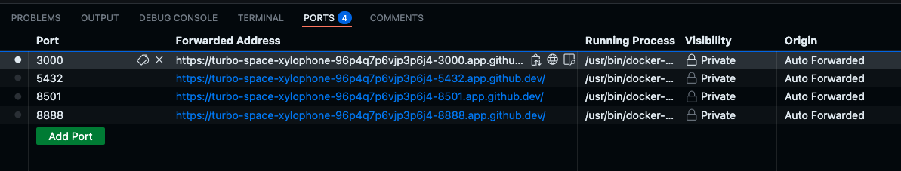
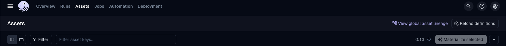
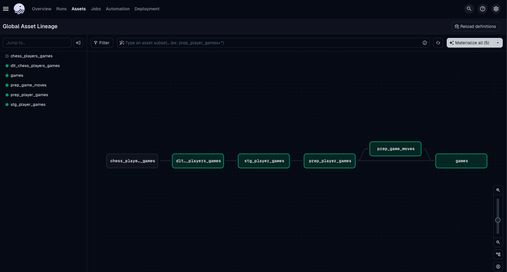

- [Chess Dashboard](#chess-dashboard)
  - [Architecture](#architecture)
  - [Architecture Diagram](#architecture-diagram)
  - [Run locally](#run-locally)
  - [Github Codespaces](#github-codespaces)
- [Running Dagster Job](#running-dagster-job)

# Chess Dashboard
## Architecture
The data engineering project stack contains the following:
1. [dltHub](https://dlthub.com/): Ingestion Layer to load the data into the data warehouse
2. [Dagster](https://dagster.io/): To schedule and orchestrate the DAGs
3. [Postgres](https://www.postgresql.org/): To store and persist Dagster details
4. [DuckDB](https://duckdb.org/): Data Warehouse
5. [Streamlit](https://streamlit.io/): Dashboard Layer

## Architecture Diagram

## Run locally
To run locally, you'll need:
1. [git](https://git-scm.com/book/en/v2/Getting-Started-Installing-Git)
2. [Github account](https://github.com/)
3. [Docker](https://docs.docker.com/engine/install/)
4. [Docker Compose](https://docs.docker.com/compose/install/)

Clone the repo, create a `.env` file and run the following commands to start the data pipeline:

1. `git clone https://github.com/jkwd/chess_dashboard.git`
2. `cd chess_dashboard`
3. `make init` to create an `.env` file
4. Edit the `CHESS_USERNAME` in the `.env` file to your username
5. `make up` to build and start the docker container
6. Go to [http://localhost:3000](http://localhost:3000) to view the Dagster UI
7. [Materialize all assets](#running-dagster-job)
8. Go to [http://localhost:8501/](http://localhost:8501/) to view the Streamlit Dashboard
9. `make down` to stop the containers

## Github Codespaces
1. Fork/Clone `https://github.com/jkwd/chess_dashboard.git` to your own Repository
2. Open in Codespaces
3. `Make init` to create an `.env` file
4. Edit the `CHESS_USERNAME` in the `.env` file to your username
5. `make up` to build and start the docker container
6. Find the forwarded addresses in `PORTS` section of the Code Editor

7. Go to Forwarded address for port `3000` to view the Dagster UI
8. [Materialize all assets](#running-dagster-job)
9. Go to Forwarded address for port `8501` to view the Streamlit Dashboard
10. `make down` to stop the containers
11. Stop/Delete Codespaces when you are done

# Running Dagster Job
1. Click on Assets Tab on the top
2. Click on View global asset ineage at the top right of the page

3. Materialize All
